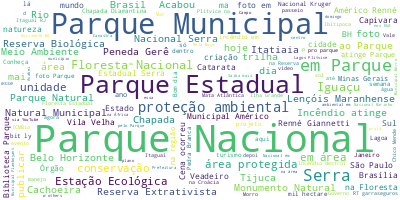

# Download-Tweets
Este repositório tem o intuito de baixar e processar
dados do registro histórico do Twitter.

## Tabela de conteúdos
- [Tabela de conteúdos](#tabela-de-conteúdos)
- [Estrutura](#estrutura)
- [Instalação](#instalação)
- [Configuração](#configuração)
- [Uso](#uso)
- [Autores](#autores)
- [Contribuição](#contribuição)
- [Citação](#citação)
- [Licença](#licença)

## Estrutura
Os principais scripts do projeto são:

* [full-archive-search](src/full-archive-search.py)
* [convert](src/convert.py)
* [choropleth](src/choropleth.py)
* [geotag](src/geotag.py)
* [getUC](src/getUC.py)
* [cloud](src/cloud.py)

São baseados na [API do twitter](https://github.com/twitterdev/Twitter-API-v2-sample-code),
[Pandas](https://pandas.pydata.org), [Folium](https://python-visualization.github.io/folium/),
[OpenCage](https://opencagedata.com) e [Wordcloud](https://github.com/amueller/word_cloud).

Há também um [arquivo](variables.py) de configuração.

Os resultados são salvos na pasta [results](results/).
Cada intervalo buscado é salvo em uma subpasta.

A pasta [resources](src/resources/) contém arquivos de entrada que são úteis ao longo do projeto.

### Full Archive Search

O Script [full-archive-search](src/full-archive-search.py) é a busca no twitter efetivamente. Dado uma query e uma API key do twitter, serão retornadas páginas JSON com os dados buscados.

### Conversão

O Script [convert](src/convert.py) faz a conversão dos dados JSON para .csv e .xlsx

### Choropleth Map

O Script [choropleth](src/choropleth.py) gera mapas do tipo choropleth. Se valendo da busca reversa do opencage (necessário API key) para transformar coordenadas geográficas em Estados brasileiros e países. Caso esses dados já estejam disponíveis é possível gerar os mapas sem o opencage.

[choropleth map](src/results/maps/choropleth_country.html)

### Geotag

O Script [geotag](src/geotag.py) gera um mapa com círculos que o raio varia conforme o número de tweets na coordenada do centro do círculo. Por não ficar muito legível, acabou por não ser utilizado.


[general_map](src/results/maps/general_map.html)

### Get UC 

O Script [getUC](src/getUC.py) utiliza expressão regular para tentar extrair o nome da Undidade de Conservação citada no texto do twitter. Por utilizar uma técnica simples, acabou por ter um resultado não muito satisfatório, acabou por não ser utilizado.

### Cloud

O Script [cloud](src/cloud.py) gera uma wordcloud das palaras que mais aparecem nos tweets buscados. O artigo tomou outro rumo e acabou por não ser utilizado. Precisa de refinamento.



## Instalação

Primeiro, instale o [python 3](https://realpython.com/installing-python/)

Instale o [pip](https://pip.pypa.io/en/stable/installing/)

Em seguida instale o [git](https://git-scm.com/downloads)

Clone o repositório: 
 
 ```
git clone https://github.com/jagra26/Download-Tweets.git
 ```

Instale os requerimentos:

 ```
pip install -r requirements.txt
 ```

## Configuração

Abra o [arquivo](variables.py) de configuração.

As variáveis *start* e *end* se referem ao intervalo de busca.
Altere para o intervalo desejado, mantendo o padrão.

A variável *path* se refere a pasta que os tweets serão salvos.
Por padrão está setada para [results](results/)

A variável *bearer_token* se refere ao token dado pela API do Twitter.
Pode ser gerada no [dashboard](https://developer.twitter.com/en/portal/dashboard)
do seu projeto

A variável *search_url* se refere a forma de busca dentro da API.
Por padrão está setado para busca histórica. Caso queira fazer a busca
só nos últimos 30 dias troque "all" por "recent" na url. Lembre-se de 
respeitar o intervalo.

A váriavel *query* se refere ao que é efetivamente buscado, siga a [documentação](https://developer.twitter.com/en/docs/tutorials/building-high-quality-filters)
do Twitter para chegar ao resultado desejado.

As variáveis terminadas em *fields* e a variável *expansions*
se referem ao campos opcionais que serão retornados pela API. 
Siga o que consta na [documentação](https://developer.twitter.com/en/docs/twitter-api/tweets/filtered-stream/api-reference/get-tweets-search-stream).

A variável *max_results* se refere a quantidade de tweets 
que cosntará em cada página. Por padrão o valor é 500, números muito altos
gerarão erros de excesso de requisições.

A variável stopwords trata das palavras que serão excluidas nas wordclouds
## Uso

Após tudo instalado e configurado, inicie buscando os tweets.
Executando o programa [full-archive-search.py](full-archive-search.py):
```
python3 full-archive-search.py
```
Este programa busca e salva os tweets, um arquivo .txt para cada página buscada.
Que ficam salvos no diretório referente ao intervalo buscado.

Para reunir a informação de todas as páginas em um único arquivo, 
utilize o programa [convert.py](convert.py):
```
python3 convert.py
```
Este programa gera duas tabelas, uma .csv e outra .xlsx
Ambas contém a informação de todas páginas anteriormente 
baixadas. Estes formatos facilitam a análise e elaboração
de gráficos.

Para gerar o choropleth map, caso não tenha um arquivo de entrada com a quantidade de tweets por país ou estado, adicione uma API key do opencage
no arquivo de configuração em *opencage_key* e descomentar as linhas 77 a 107 de choropleth.py. Caso tenha, basta rodar o programa: 

```
python3 choropleth.py
```
Para gerar o mapa de incidência com o raio variável, altere os arquivos de entrada, saída e diretórios a partir da linha 93 para que seja compatível com o seu.
E utilize:
```
python3 geotag.py
```

Para gerar um .csv com o possível nome das UCs, altere os arquivos de entrada, saída e diretórios a partir da linha 51 para que seja compatível com o seu.
E utilize:
```
python3 getUC.py
```

Para gerar as wordclouds das buscas utilize:
```
python3 cloud.py
```

## Autores

Carolina Neves
  * [Lattes](http://lattes.cnpq.br/6552839552231088)
  * [Github](https://github.com/carolinaneves-ufal) 

João Almeida
  * [Lattes](http://lattes.cnpq.br/7977737909149890)
  * [Github](https://github.com/jagra26)

## Contribuição

Este projeto é funcional, porém está aberto a melhorias e contribuições são bem vindas para que, se possível, se torne uma biblioteca voltada a busca acadêmica de tweets. Dê fork do projeto, altere como quiser e dê pull request para que as mudanças sejam aceitas.

## Citação

Um artigo com os dados obtidos com esse projeto está sendo feito, quando for publicado, o link será disponibilizado aqui.

## Licença

O projeto utiliza [licença MIT](LICENSE.txt)
